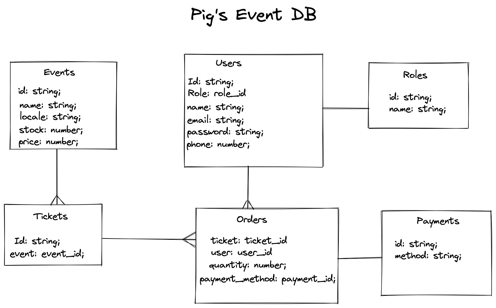

## The challenge:

### - It consists of creating an API for registration and sale at university and company events

## Development:

[Link for excalidraw](https://excalidraw.com/#room=8b78765e8a72430ed558,1KSmkK6hKqbHFqG3AtsS2Q)

### I used some tools for requirement analysis and development.

### I used excalidraw for abstraction, so I could analyze in detail what the flow would be.

### Database:

